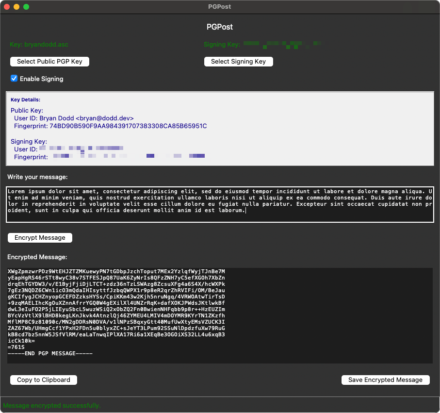

# PGPost

PGPost was a learning exercise for both Python and PGP, but turned out to be very useful. It is a very basic Python GUI application that accepts a public PGP encryption key and text to render an encrypted PGP message.

It optionally accepts a signing key, and with signing enabled, produces a signed encrypted message. The results can be copied to the system clipboard or saved locally as an `.asc` file. 

{ width=700 }

### Notes

The tool was built in a Python 3.12.8 environment and requires only two packages (noted below). 

There are a number of improvements that can be made, both in functionality and to it's interface - if anyone ever expands on this or reworks it, I would be very interested in seeing the updated product. 

At some point, I'd like to incorporate the gnupg keyring and decryption functionality, but having something extremely lightweight and portable to make encrypting messages a breeze for people without a lot of hands-on PGP experience has proven helpful.

### Dependencies

- [python-gnupg](https://pypi.org/project/python-gnupg/)
- [pyperclip](https://pypi.org/project/pyperclip/)

### Source

``` python linenums="1"
import os
import tkinter as tk
from tkinter import filedialog
from tkinter import font as tkfont
import gnupg
import pyperclip

# Initialize GPG
gpg = gnupg.GPG()

class PGPost:
    def __init__(self, root):
        self.root = root
        self.root.title("PGPost")
        self.root.iconphoto(False, tk.PhotoImage(file="app_icon.png")) 

        # Selected PGP Key
        self.selected_key = None
        self.imported_key_fingerprint = None
        self.signing_key_fingerprint = None
        self.enable_signing = tk.BooleanVar(value=False)

        # Define fonts
        self.default_font = tkfont.nametofont("TkDefaultFont")
        self.bold_font = self.default_font.copy()
        self.bold_font.configure(weight="bold")

        # Main Frame with Padding
        self.main_frame = tk.Frame(root, padx=12, pady=12)
        self.main_frame.pack(fill="both", expand=True)

        # Title
        tk.Label(self.main_frame, text="PGPost", font=(self.bold_font, 16)).pack(pady=2)

        # Key Selection Frame
        self.key_selection_frame = tk.Frame(self.main_frame)
        self.key_selection_frame.pack(fill="x", pady=5)

        self.key_label = tk.Label(self.key_selection_frame, text="No public key selected", fg="red")
        self.signing_key_label = tk.Label(self.key_selection_frame, text="No signing key selected", fg="red")

        self.key_label.grid(row=0, column=0, sticky="w", padx=5, pady=5)
        self.signing_key_label.grid(row=0, column=1, sticky="w", padx=5, pady=5)

        tk.Button(self.key_selection_frame, text="Select Public PGP Key", command=self.select_public_key).grid(row=1, column=0, sticky="w", padx=5, pady=5)
        tk.Button(self.key_selection_frame, text="Select Signing Key", command=self.select_signing_key).grid(row=1, column=1, sticky="w", padx=5, pady=5)        

        for i in range(2):
            self.key_selection_frame.grid_columnconfigure(i, weight=1)
            self.key_selection_frame.grid_rowconfigure(i, weight=1)

        # Signing Checkbox
        tk.Checkbutton(
            self.key_selection_frame,
            text="Enable Signing",
            variable=self.enable_signing,
        ).grid(row=2, column=0, columnspan=2, sticky="w", padx=5, pady=5)

        # Key Details Frame
        self.key_details_frame = tk.Frame(self.main_frame, bg="#f0f0f0", relief=tk.RIDGE, borderwidth=2, padx=5, pady=5)
        self.key_details_frame.pack(pady=5, fill=tk.X)
        tk.Label(self.key_details_frame, text="Key Details:", bg="#f0f0f0", fg="darkblue", font=(self.default_font, 10, "bold")).pack(anchor="w")
        self.key_details_label = tk.Label(self.key_details_frame, text="None", bg="#f0f0f0", fg="darkblue", wraplength=900, justify="left")
        self.key_details_label.pack(anchor="w", pady=2)

        # Email Input
        tk.Label(self.main_frame, text="Write your message:", anchor="w").pack(anchor="w", pady=5)
        self.email_text = tk.Text(self.main_frame, width=125, height=15)
        self.email_text.pack(pady=5)

        # Encrypt Button
        tk.Button(self.main_frame, text="Encrypt Message", command=self.encrypt_email).pack(pady=10, anchor="w")

        # Encrypted Output
        tk.Label(self.main_frame, text="Encrypted Message:", anchor="w").pack(anchor="w", pady=5)
        self.encrypted_text = tk.Text(self.main_frame, width=125, height=15, state="disabled")
        self.encrypted_text.pack(pady=5)

        # Bottom Button Frame
        self.button_frame = tk.Frame(self.main_frame)
        self.button_frame.pack(pady=10, fill=tk.X)
        tk.Button(self.button_frame, text="Copy to Clipboard", command=self.copy_to_clipboard).pack(side="left", padx=5)
        tk.Button(self.button_frame, text="Save Encrypted Message", command=self.save_to_file).pack(side="right", padx=5)

        # Status Bar
        self.status_bar = tk.Label(self.root, text="Ready", bd=1, relief=tk.SUNKEN, anchor="w", padx=5)
        self.status_bar.pack(side="bottom", fill="x", ipady=7)

    def update_status(self, message, bold=False, color="white"):
        """Updates the status bar."""
        font = self.bold_font if bold else self.default_font
        self.status_bar.config(text=message, fg=color, font=font)

    def select_public_key(self):
        key_file = filedialog.askopenfilename(title="Select Public PGP Encryption Key", filetypes=[("PGP Key Files", "*.asc"), ("All Files", "*.*")])
        if key_file:
            with open(key_file, "r") as file:
                key_data = file.read()
                import_result = gpg.import_keys(key_data)

            if not import_result.count:
                self.update_status("Failed to import the public PGP key!", bold=True, color="red")
                self.key_label.config(text="No public key selected", fg="red")
                self.key_details_label.config(text="None", fg="darkblue")
                return

            # Update Key Information
            self.selected_key = key_file
            self.imported_key_fingerprint = import_result.fingerprints[0]
            key_details = gpg.list_keys(keys=[self.imported_key_fingerprint])[0]
            user_id = key_details.get("uids", ["Unknown User"])[0]

            self.key_label.config(text=f"Key: {os.path.basename(key_file)}", fg="green")
            self.update_key_details()
            self.update_status("PGP key successfully imported.", color="green")
        else:
            self.update_status("No public key selected.", bold=True, color="orange")

    def select_signing_key(self):
        key_file = filedialog.askopenfilename(title="Select Signing Key", filetypes=[("PGP Key Files", "*.asc"), ("All Files", "*.*")])
        if key_file:
            with open(key_file, "r") as file:
                key_data = file.read()
                import_result = gpg.import_keys(key_data)

            if not import_result.count:
                self.update_status("Failed to import the signing key!", bold=True, color="red")
                self.signing_key_label.config(text="No signing key selected", fg="red")
                return

            # Update Signing Key Information
            self.signing_key_fingerprint = import_result.fingerprints[0]
            key_details = gpg.list_keys(keys=[self.signing_key_fingerprint])[0]
            user_id = key_details.get("uids", ["Unknown User"])[0]

            self.signing_key_label.config(text=f"Signing Key: {os.path.basename(key_file)}", fg="green")
            self.update_key_details()
            self.update_status("Signing key successfully imported.", color="green")
        else:
            self.update_status("No signing key selected.", bold=True, color="orange")

    def update_key_details(self):
        """Update the Key Details section."""
        details = []
        if self.imported_key_fingerprint:
            key_details = gpg.list_keys(keys=[self.imported_key_fingerprint])[0]
            user_id = key_details.get("uids", ["Unknown User"])[0]
            details.append(f"Public Key:\n  User ID: {user_id}\n  Fingerprint: {self.imported_key_fingerprint}")
        if self.signing_key_fingerprint:
            key_details = gpg.list_keys(keys=[self.signing_key_fingerprint])[0]
            user_id = key_details.get("uids", ["Unknown User"])[0]
            details.append(f"Signing Key:\n  User ID: {user_id}\n  Fingerprint: {self.signing_key_fingerprint}")
        self.key_details_label.config(text="\n\n".join(details) if details else "None")
    def encrypt_email(self):
        if not self.imported_key_fingerprint:
            self.update_status("Please select a valid public PGP key first!", bold=True, color="red")
            return

        # Get Email Content
        email_content = self.email_text.get("1.0", tk.END).strip()
        if not email_content:
            self.update_status("Message content cannot be empty!", bold=True, color="red")
            return

        # Sign Email
        sign_with = self.signing_key_fingerprint if self.enable_signing.get() and self.signing_key_fingerprint else None

        # Encrypt Email
        encrypted_data = gpg.encrypt(email_content, self.imported_key_fingerprint, sign=sign_with)
        if not encrypted_data.ok:
            self.update_status(f"Encryption failed: {encrypted_data.stderr}", bold=True, color="red")
            return

        # Display Encrypted Content
        self.encrypted_text.config(state="normal")
        self.encrypted_text.delete("1.0", tk.END)
        self.encrypted_text.insert("1.0", str(encrypted_data))
        self.encrypted_text.config(state="disabled")
        self.update_status("Message encrypted successfully.", color="green")

    def copy_to_clipboard(self):
        encrypted_content = self.encrypted_text.get("1.0", tk.END).strip()
        if encrypted_content:
            pyperclip.copy(encrypted_content)
            self.update_status("Encrypted content copied to clipboard.", color="green")
        else:
            self.update_status("No encrypted content to copy!", bold=True, color="red")

    def save_to_file(self):
        encrypted_content = self.encrypted_text.get("1.0", tk.END).strip()
        if not encrypted_content:
            self.update_status("No encrypted content to save!", bold=True, color="red")
            return

        # Save File Dialog
        save_path = filedialog.asksaveasfilename(title="Save Encrypted Message", defaultextension=".asc", filetypes=[("PGP Encrypted Files", "*.asc"), ("All Files", "*.*")])
        if save_path:
            try:
                with open(save_path, "w") as file:
                    file.write(encrypted_content)
                self.update_status(f"Encrypted message saved to {save_path}", color="green")
            except Exception as e:
                self.update_status(f"Failed to save file: {e}", bold=True, color="red")

# Run the application
if __name__ == "__main__":
    root = tk.Tk()
    app = PGPost(root)
    root.mainloop()
```