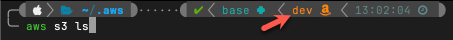

# AWS MFA Authentication Helper

The helper script below assumes the following configuration:

- MFA key is stored on Yubikey.
    - Key name is set appropriately to match Yubikey. `(line 11)`
- AWS IAM MFA ARN is set appropriately. `(line 17)`

!!! abstract "How it works..."

    Once authenticated, the script adds a new entry to the bottom of `~/.aws/credentials` labeled `[cli]`; however, session variables are ***also*** assigned. As long as you remain in the *^^same shell session^^*, you will not have to pass `--profile cli` with each command. 
    
    Additional terminal windows is a new session and can't use the previously set local variables, so to utilize the authentication performed earlier, pass `--profile cli` with each command to utilize the existing valid authentication. Example: `#!bash aws s3 ls --profile cli`

    **Performing a second authentication in a different window will overwrite the previous authentication's token and invalidate that session.**

``` zsh linenums="1" hl_lines="11 17 30 31"
alias awslogin="awsToken "

awsToken() { 
    ykTest=$(ykman list)
    if [ -z "$ykTest" ]; then
        printf "${color_yellow_italic}YubiKey not detected.${color_nocolor}\n"
        printf "Insert key and try again.\n"
        return 1
    fi
    printf "${cyanarrow}${color_cyan2} YubiKey detected...${color_nocolor}\n"
    ykOathValue="AWS [Prod]:name@example.com" # (1)
    unset AWS_SESSION_TOKEN;
    unset AWS_SECRET_ACCESS_KEY;
    unset AWS_ACCESS_KEY_ID;
    unset PROFTXT;
    unset AWSUME_PROFILE;
    MFA="arn:aws:iam::123456789876:mfa/name@example.com" # (2)
    MFACODE=$(ykman oath accounts code -s "$ykOathValue")
    if [ $? -eq 1 ]; then
        printf "${color_yellow_italic}Correct OATH token not found on YubiKey!${color_nocolor}\n"
        return 1
    fi
    AWSCREDS=`aws sts get-session-token --serial-number $MFA --token-code $MFACODE`;
    ACCESS_KEY=`echo $AWSCREDS | jq .Credentials.AccessKeyId`
    SECRET_KEY=`echo $AWSCREDS | jq .Credentials.SecretAccessKey`
    SESSION_TOKEN=`echo $AWSCREDS | jq .Credentials.SessionToken`
    export AWS_ACCESS_KEY_ID=`echo $ACCESS_KEY | sed -e 's/^"//' -e 's/"$//'`
    export AWS_SECRET_ACCESS_KEY=`echo $SECRET_KEY | sed -e 's/^"//' -e 's/"$//'`
    export AWS_SESSION_TOKEN=`echo $SESSION_TOKEN | sed -e 's/^"//' -e 's/"$//'`
    export PROFTXT="XYZ AWS" # (3)
    export AWSUME_PROFILE="prod" # (4)
    echo "$(awk '/cli/{n=4}; n {n--; next}; 1' $HOME/.aws/credentials)" > $HOME/.aws/credentials
    echo "" >> $HOME/.aws/credentials
    echo "[cli]" >> $HOME/.aws/credentials
    TMP1=$(echo "aws_access_key_id = $ACCESS_KEY" | tr -d \")
    echo $TMP1 >> $HOME/.aws/credentials
    TMP2=$(echo "aws_secret_access_key = $SECRET_KEY" | tr -d \")
    echo $TMP2 >> $HOME/.aws/credentials
    TMP3=$(echo "aws_session_token = $SESSION_TOKEN" | tr -d \")
    echo $TMP3 >> $HOME/.aws/credentials
    echo -e "\n\033[7;33""m NOTICE - NOTICE - NOTICE - NOTICE - NOTICE \033[0m"
    echo -e "\033[5;33""m ==> -> DLRDMV AWS ACCOUNT ACTIVE <- <== \033[0m"
    echo " "
    export AWS_PAGER='' && aws sts get-caller-identity --output yaml && export AWS_PAGER='less'
}

# Quickly identify which profile you're authenticated against.
awsprofile() { 
    if [ -z "$PROFTXT" ]
    then
        echo "${color_yellow_italic}NO PROFILE IS ACTIVE${color_nocolor}"
    else
        echo -e "\033[7;33""m =========================================== \033[0m"
        echo -e "\033[5;33""m ==> -> $PROFTXT ACCOUNT ACTIVE <- <== \033[0m"
        echo -e "\033[7;33""m =========================================== \033[0m"
        echo " "
        export AWS_PAGER='' && aws sts get-caller-identity --output yaml && export AWS_PAGER='less'
    fi
}
```

1.  Key value must match the name as defined when the MFA value was added to Yubikey.
2.  MFA ARN is located under the "Security credentials" tab of the IAM user.
3.  If you regularly access multiple AWS accounts, `PROFTXT` can be used to quickly identify which environment is currently active.
4.  p10k can read AWSUME_PROFILE (`/internal/p10k.zsh`) to show this value on the terminal prompt. It's useful for seeing at a glance which environment your command will apply to. <br /><br /> 