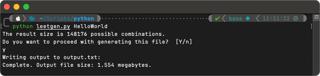

# Leetgen

Leetgen is a quick-and-dirty password list generator. It accepts a single input string and generates a wordlist of possible "leetspeak" permutations for that string. Helpful if you suspect there's a very high likelihood that someone is or will use a password based off of a well-known phrase or word. This is most commonly seen in organizations where they have their own internal phraseology or idioms. 

{ width=600, align=right }

Run from the command-line, supply it with a single string and it will return a count of the calculated permutations. 

Be aware, however, that because there could be many possible iterations, lists can grow quite large and eat up available space. If allowed to generate the file, it will be saved to `output.txt` in the same directory as the script file.

!!! danger "Don't be a dick..."

    This tool has it's uses, but unapproved pentesting and other nefarious practices aren't one of them. This tool is meant for helping build lists of passwords that systems should block or prevent users from adopting due to poor security. 

## Script

``` python linenums="1" title="Leetgen.py"
import sys
import os
import itertools

argCount = len(sys.argv)
processWord = ""

if (argCount == 2):
    processWord = sys.argv[1]
else:
    print ("This script accepts a single input parameter only.")
    sys.exit()

def leet(word):
    leet_matches = [
        ['a', 'A', '4', '@'],
        ['b', 'B', '8'],
        ['c', 'C'],
        ['d', 'D'],
        ['e', 'E', '3'],
        ['f', 'F'],
        ['g', 'G', '6'],
        ['h', 'H'],
        ['i', 'I', '1', '!', '|'],
        ['j', 'J'],
        ['k', 'K'],
        ['l', 'L', '1', '!', '|', '/', '\\'],
        ['m', 'M'],
        ['n', 'N'],
        ['o', 'O', '0'],
        ['p', 'P'],
        ['q', 'Q'],
        ['r', 'R'],
        ['s', 'S', '5', '$', '~'],
        ['t', 'T', '7', '+'],
        ['u', 'U'],
        ['v', 'V'],
        ['w', 'W'],
        ['x', 'X', '+'],
        ['y', 'Y'],
        ['z', 'Z', '2'],
        ['0', 'o', 'O'],
        ['1', '!', '|', 'l'],
        ['2', 'z', 'Z'],
        ['3', 'e', 'E'],
        ['4', 'a', 'A'],
        ['5', 's', 'S'],
        ['6', 'g', 'G'],
        ['7', 't', 'T', '+'],
        ['8', 'b', 'B'],
        ['9'],
        ['`'],
        ['~'],
        ['!', 'i', 'I', '|'],
        ['@', 'a', 'A'],
        ['#'],
        ['$', 's', 'S'],
        ['%'],
        ['^'],
        ['&'],
        ['*'],
        ['('],
        [')'],
        ['-', '_'],
        ['_', '-'],
        ['='],
        ['+'],
        ['['],
        ['{'],
        [']'],
        ['}'],
        ['\\', '/', '|', 'I', '1'],
        ['|', 'l', '1', '!'],
        [';'],
        [':'],
        ["'"],
        ['"'],
        [',', '.'],
        ['<'],
        ['.', ','],
        ['>'],
        ['/', 'l', '|', 'I', '1'],
        ['?'],
    ]
    l_set = []
    l_size= []
    for letter in word:
        for match in leet_matches:
            if match[0] == letter.lower():
                l_set.append(match)
                l_size.append(len(match))
    
    resultSize = 0

    for set in l_size:
        if resultSize == 0:
            resultSize = set
        else:
            resultSize = resultSize * set

    print (f"The result size is {resultSize} possible combinations.")
    print ("Do you want to proceed with generating this file?  [Y/n]")
    affirmative = {'yes', 'y', 'ye', ''}
    choice = input().lower()
    if choice in affirmative:
        return [ ''.join(t) for t in itertools.product(*l_set) ]
    else:
        return []

results = leet(processWord)

if (len(results) > 0):
    print ("Writing output to output.txt:")
    with open('output.txt', 'w') as f:
        for word in results:
            f.write(f'{word}\n')
    fileInfo = os.stat('output.txt')
    fileSize = round(fileInfo.st_size/1024/1024,3)
    print (f"Complete. Output file size: {fileSize} megabytes.")
else:
    print ("Aborted.")
```

## Extending Results

Modifying the script is straightforward - `leet_matches` (beginning on line 15) is a list of lists of characters. The list includes every letter of alphabet, followed by numbers, then special characters. Each list is individually extended to include potential characters that might be substituted for the original character. 

The character mapping included in original script is not complete - there could be dozens more potential mappings, so feel free to modify to suit your needs. 
