# Yubikey PIV (Personal Identity Verification)

Yubikeys are multi-faceted and can be used for a number of different security needs. One of those is to function like a "smart card" through it's PIV functionality. Think of this like a digital ID card that proves who you are when logging into computers or securing files. 

PIV is like a digital passport - it contains a special digital certificate that proves your identity, just like a real passport proves who you are at the airport. Instead of using a password, your compuer can check your Yubikey to confirm that its really you trying to log in. Your private key is stored safely within the Yubikey and can't ever be exported.

It can be used for anything from logging into computers securely, SSH'ing into a remote machine, encrypting files/email, and digitally signing documents. One example of this is signing documents in Adobe Acrobat. It's a different kind of signature from simply putting your "written" signature on a document - instead, it relies on a certificate stored in Yubikey that identifies who you are. 

PIV can perform sign/encrypt operations through common interfaces like PKCS#11. And Yubikey supports RSA and ECDSA keys for this purpose. I'll touch on this a little later, but even though Yubikey supports ED25519 keys, there is a limitation with PKCS#11 currently that prevents us from using them easily. For now, I'm using RSA keys due to their widespread support with both new and legacy systems. 

!!! important "Default PINs"

    If this is a new key and you haven't modified anything yet, make note of the PIV defaults below. We'll be changing them shortly.
    
    - **PIN: `123456`**
    - **PUK: `12345678`**
    - **Mgmt Key: `(3DES) 010203040506070801020304050607080102030405060708`**

## PIN Management

PIV has two levels of access:

* End-user (cardholder) level - protected by a PIN. This level is for the normal daily usage of PIV functionality.
* Administrator level - protected by management key. This level is for provisioning credentials.

The table below lists the different PIV operations and when the PIN, PUK, or Management Key (MGMT) are needed:

| Action | MGMT | PIN | PUK | Comments | 
| ------ | :--: | :-: | :-: | -------- |
| Generate key pair | :fontawesome-regular-circle-check: |  |  |  |
| Change MGMT | :fontawesome-regular-circle-check: |  |  | Requires a new MGMT |
| Change retry counters | :fontawesome-regular-circle-check: | :fontawesome-regular-circle-check: |  | Yubico extension. Resets PIN and PUK to defaults |
| Import private key | :fontawesome-regular-circle-check: |  |  |  |
| Import certificate | :fontawesome-regular-circle-check: |  |  |  |
| Move key | :fontawesome-regular-circle-check: |  |  |  |
| Delete key | :fontawesome-regular-circle-check: |  |  |  |
| Set CHUID | :fontawesome-regular-circle-check: |  |  |  |
| Reset card |  |  |  | Requires both PIN and PUK to be blocked |
| Verify PIN |  | :fontawesome-regular-circle-check: |  |  |
| Sign data |  | :fontawesome-regular-circle-check: |  |  |
| Decrypt data |  | :fontawesome-regular-circle-check: |  |  |
| Change PIN |  | :fontawesome-regular-circle-check: |  | Requires a new PIN |
| Change PUK |  |  | :fontawesome-regular-circle-check: | Requires a new PUK |
| Reset PIN (unblock) |  |  | :fontawesome-regular-circle-check: | Requires a new PIN |

Newer firmwares for Yubikey support a 64-character Management Key (AES-256). For maximum security, generate a random compatible string for use as your Management Key:

``` bash
head -c 32 /dev/urandom | hexdump -e '16/1 "%02x" "\n"'
```

This should output a string like the example below:

```
77343a10df05ede9758df5b248e45eb9e7f95fca74bbe9e3f17e7e3611249acd
```

***Save this value to your password manager***, and proceed with the rest of the Yubikey PIV setup. In the steps below, we'll be replacing the Yubikey Management Key, PIN, and PIN Unlock Key (PUK).  But before we get that far, if you want to change your retry counters from their default value of 3, this is the time to do it. Your Management Key will remain unchanged, but changing the retry counters will reset the PIN and PUK (if you've already set them). It's best to change this first to avoid having to reset your PIN and PUK a second time later. 

``` bash
# Change the PIN and PUK retry counts from 3 to 6
ykman piv access set-retries -m 010203040506070801020304050607080102030405060708 -P 123456 6 6
```

!!! warning inline end "Lost Keys / PINS"

     If you lose your ***Management Key***, the only way to recover is to [completely reset](https://developers.yubico.com/PIV/Guides/Device_setup.html) all PIV functionality, <span style="color: yellow">erasing all keys/certs</span> on the device. This only affects the PIV features.

     If the wrong ***PIN*** is entered *3 times consecutively*, the PIN will become **blocked** (totally unusable). You must use the **PUK** to set a new PIN.

``` bash
# Replace the 3DES default management key with AES256 and the random string generated earlier
ykman piv access change-management-key \
    -m 010203040506070801020304050607080102030405060708 \
    -a AES256 \
    -n 77343a10df05ede9758df5b248e45eb9e7f95fca74bbe9e3f17e7e3611249acd
```

``` bash
# Replace the default PIN
ykman piv access change-pin -P 123456 -n 654321
```

``` bash
# Replace the default PUK
ykman piv access change-puk -p 12345678 -n 87654321
```

For the sake of example, the commands above have changed the PIN and PUK to the reverse of their default values.

## Certificate Slots

Yubikey 5's hold 24 slots, each capable of holding an X.509 certificate along with its accompanying private key. The slots are very similar, but used for different purposes. Although you can use just about any slot for any purpose, it's best to use them as prescribed by Yubico for maximum compatibility and to avoid confusion.

<span style="color: dodgerblue">***Slot 9a: PIV Authentication***</span>

:    Used to authenticate the card and the cardholder. This slot is used for things like system login. PIN is required. Once provided successfully, multiple private key operations can be performed without additional cardholder consent. 

     ***Example use case:*** Add your SSH key. Load your public key to remote servers as an authorized key, and use the PKCS#11 interface to authenticate during login. The PKCS#11 interface can also be used to connect this slot to GitHub.

<span style="color: dodgerblue">***Slot 9c: Digital Signature***</span>

:    Used for digital signatures for the purpose of document signing, or signing files and executables. PIN is required, and must be submitted every time immediately before a sign operation to ensure cardholder participation at every digital signature generated.

     ***Example use case:*** Adobe Acrobat signatures, code-signing, etc.

<span style="color: dodgerblue">***Slot 9d: Key Management***</span>

:    Used for encryption. This slot is used for things like encrypting email or files. PIN is required. Once provided successfully, multiple private key operations can be performed without additional cardholder consent.

     ***Example use case:*** S/MIME certificates for mail encryption via your email client. This slot is NOT intended for GPG encryption.

<span style="color: dodgerblue">***Slot 9e: Card Authentication***</span>

:    Used to support physical access applications like providing access to a building via PIV-enabled door locks. PIN is **not** required to perform private key operations with this slot.

<span style="color: dodgerblue">***Slots 82 through 95: Retired Key Management***</span>

:    These slots are intended for previously used Key Management keys in order to be able to decrypt previously encrypted documents or emails.

<span style="color: dodgerblue">***Slot f9: Attestation***</span>

:    No, that's not a typo - the slot is `f9`. This slot can only be used for attestation of other keys generated ***on-device*** with instruction `f9`. This slot is not cleared on reset, but can be overwritten. Read more about [PIV Attestation](https://developers.yubico.com/PIV/Introduction/PIV_attestation.html) on the Yubico website.

---

### About Certificates

The normal way to go about getting certificates for use with Yubikey is to purchase them from known certification authorities. This is the approach you'd want to take if you were a business purchasing certificates for employees to use to sign official company documents. These can get quite expensive. They're usually only valid for a limited period of time, and some of them only allow a certain number of signing or certifying events before you have to pay to bump up to the next tier. And finding certificates that you can load onto your existing Yubikey can be challenging. 

I encourage you to read more about this in Adobe's own documentation:

* [Adobe Approved Trust List](https://helpx.adobe.com/acrobat/kb/approved-trust-list1.html) (these are who you would need to purchase certificates from to have them work most readily / reliably with Adobe Acrobat)
* [About certificate signatures in Adobe Acrobat](https://helpx.adobe.com/acrobat/kb/certificate-signatures.html)
* [How to create certificate-based signatures in Adobe Acrobat](https://helpx.adobe.com/acrobat/using/certificate-based-signatures.html) (how to use your certificates to sign documents)

With that said, the approach I've taken below is to effectively create my own Public Key Infrastructure (PKI). This just means that I'm creating my own self-signed Root Certificate Authority, creating an Intermediate CA, and then issuing certificates from my Intermediate CA for use with my Yubikey. The down side is that if someone received an Adobe document from me that I signed with my keys, Adobe would alert them that the signature isn' recognized by one of their "Adobe Approved Trust List" vendors. However - I've published both my Root CA and Intermediate CA on GitHub so that anyone receiving a signed document that claimed to be signed by me, could indeed be validated using my custom CA certificates. The process adds extra steps, because it would require someone to grab my CA certificates, install them, and mark them as Trusted. But then going forward, any document they received signed by me (with these certificates) would be flagged as a valid, authentic signature. 

This document isn't going to go through all of the steps in detail needed to setup your own PKI -- but I will cover some of the different attributes that I gave my Authentication (9a) and Signing (9c) certificates.

---

### Slot 9a - Authentication

For my purposes, I want the Authentication key to be multi-purpose - usable for SSH authentication, but also for other forms of authentication as well. To make this simpler, I'm use a tool called [XCA](https://www.hohnstaedt.de/xca/index.php) to manage a personal PKI, complete with Root CA, Intermediate CA, and individual keys. This is absolutely not required, but how I've chosen to go about it for my personal use *(and because I don't want to pay $300+ annually for "Adobe Approved" certificates)*. If you're interested in learning more about XCA, you can check them out on [GitHub](https://github.com/chris2511/xca) and pick it up via [Homebrew](https://formulae.brew.sh/cask/xca#default). 

Be aware that to use these keys with Yubikey, you need a PKCS#11 library. For macOS, there are multiple options, though the two most common are:

* `/usr/lib/ssh-keychain.dylib` - A native PKCS#11 module for macOS that enables SSH to use keys stored in the system keychain.
* `/opt/homebrew/lib/libykcs11.dylib` - Yubico's PKCS#11 module, packaged with `yubico-piv-tool`.

The primary differences between them are:

* SSH agent forwarding only works with `ssh-keychain.dylib`. Generally speaking, SSH agent forwarding should be avoided for security reasons - only perform SSH agent forwarding to machines you have high levels of trust in.
* The Yubico library, `libykcs11.dylib`, will export ***all*** keys stored on Yubikey. The slot order remains the same, so utilizing the slots for their intended purpose makes identifying the public keys associated with your target private key much easier. 

Yubikey itself supports ED25519 keys with the PIV application, but there are limitations in PKCS#11 libraries that make it a royal pain to try to work with at present. I recommend sticking with the tried and true RSA until such time there are better ED25519 options available.

My Root and Intermediate CAs are both 4096-bit, but my `Authentication (9a)` and `Signing (9c)` certificates are 2048-bit for maximum compatibility.

The `Key Usage` and `Extended Key Usage` will be based on your specific needs -- for my purposes, here are the values I've selected:

**Key Usage**

* ***Digital Signature*** - required for authentication tasks (proof of possession of the private key in challenges)
* ***Key Encipherment*** - required for key exchange in protocols like TLS
* ***Non-Repudiation*** - content commitment

**Extended Key Usage**

* ***TLS Web Client Authentication*** (`1.3.6.1.5.5.7.3.2`) - enables authentication to systems and services (VPN, web applications, SSH, etc.)
* ***Smartcard Logon*** (`1.3.6.1.4.1.311.20.2.2`) - required for Windows Smart Card logon
* ***Email Protection*** (`1.3.6.1.5.5.7.3.4`) - used for S/MIME email encryption or signing
* ***SSH Client***
* ***IPSec End Systems*** (`1.3.6.1.5.5.7.3.5`) - used for authentication in IPSec-based VPNs
    * Also included (for maximum compatibility with legacy systems):
        * IPSec Tunnel
        * IPSec User
        * IP security end entity

``` bash
# from the directory where you've saved and output your Private Key & Certificate in PEM format
# (if your private key has a passphrase associated, you'll be prompted for that passphrase or
# can modify this command to pass it at load-time)
ykman piv keys import -m <mgmt-key-here> 9a private-key-for-9a.pem

ykman piv certificates import -m <mgmt-key-here> --pin <pin> --verify 9a cert-for-9a.crt
# if the management key or pin are not provided, you will be prompted to enter them
```

---

### Slot 9c - Digital Signature

For the signature certificate, my `Key Usage` and `Extended Key Usage` are:

**Key Usage**

* ***Digital Signature*** - mandatory for signing operations
* ***Non-Repudiation*** - indicates signatures are binding, commonly used for legal and regulatory compliance
* Critical: `true`

**Extended Key Usage**

* ***Microsoft Office Signing*** (`1.3.6.1.4.1.311.10.3.12`), widely accepted as `Document Signing`
* ***Adobe PDF Signing*** (`1.2.840.113583.1.1.5`) - specific to Adobe and used to help Acrobat identify specific keys as suitable for PDF signing
* ***Email Protection*** (`1.3.6.1.5.5.7.3.4`) - used for signing email
* ***Time Stamping*** (`1.3.6.1.5.5.7.3.8`) - used for trusted timestamping
* ***Code Signing*** (`1.3.6.1.5.5.7.3.3`) - used for signing software or scripts to verify authenticity and integrity
* ***Microsoft Individual Code Signing*** (`1.3.6.1.4.1.311.2.1.21`) - used for code signing by an individual developer rather than an organization or company
* Critical: `false`

``` bash
# from the directory where you've saved and output your Private Key & Certificate in PEM format
# (if your private key has a passphrase associated, you'll be prompted for that passphrase or
# can modify this command to pass it at load-time)
ykman piv keys import -m <mgmt-key-here> 9c private-key-for-9c.pem

ykman piv certificates import -m <mgmt-key-here> --pin <pin> --verify 9c cert-for-9c.crt
# if the management key or pin are not provided, you will be prompted to enter them
```

---

### Slot 82 & 83 - Root and Intermediate CA (Retired Key Slots)

If using a *roll-your-own* PKI, it will be helpful to have a copy of your Root and Intermediate CA certificates available on-the-go.  You can accomplish this easily by storing them in slots 82 and 83 of Yubikey, ensuring you have them with you at all times for full-chain signatures. 

``` bash
# Root CA in Slot 82
ykman piv certificates import -m 77343a10df05ede9758df5b248e45eb9e7f95fca74bbe9e3f17e7e3611249acd 82 your-root-ca.crt
Certificate imported into slot RETIRED1

# Intermediate CA in Slot 83
ykman piv certificates import -m 77343a10df05ede9758df5b248e45eb9e7f95fca74bbe9e3f17e7e3611249acd 83 your-intermediate.ca.crt
Certificate imported into slot RETIRED2
```

---

## Verify Slots

Certificates can be verified with the following commands:

``` bash
$ ykman piv info

PIV version:              5.7.1
PIN tries remaining:      6/6
PUK tries remaining:      6/6
Management key algorithm: AES256
CHUID: <your-chuid-value>
CCC:   No data available
Slot 82 (RETIRED1):
  Private key type: EMPTY
  Public key type:  RSA4096
  Subject DN:       1.2.840.113549.1.9.1=info@example.com,CN=My Root CA,OU=Certificate Authority,O=MeMyselfAndI,L=MyCity,ST=MyState,C=US
  Issuer DN:        1.2.840.113549.1.9.1=info@example.com,CN=My Root CA,OU=Certificate Authority,O=MeMyselfAndI,L=MyCity,ST=MyState,C=US
  Serial:           1234567891234567891 (0x111c222b333d444e)
  Fingerprint:      769fb8695f130bb752b59ae794c9dad19ddaff399822c7f49d729afa505e3b98
  Not before:       2025-01-25T00:00:00+00:00
  Not after:        2045-01-31T23:59:59+00:00

Slot 83 (RETIRED2):
  Private key type: EMPTY
  Public key type:  RSA4096
  Subject DN:       1.2.840.113549.1.9.1=info@example.com,CN=My Intermediate CA,OU=Certificate Authority,O=MeMyselfAndI,L=MyCity,ST=MyState,C=US
  Issuer DN:        1.2.840.113549.1.9.1=info@example.com,CN=My Root CA,OU=Certificate Authority,O=MeMyselfAndI,L=MyCity,ST=MyState,C=US
  Serial:           9876543210987654321 (0x555d666e777f888a)
  Fingerprint:      29c8ba82731d79be8c8520d68ba65e15df3d8dcc1a9d3da282e1e786f329c4ae
  Not before:       2025-01-25T00:00:00+00:00
  Not after:        2045-01-31T23:59:59+00:00

Slot 9A (AUTHENTICATION):
  Private key type: RSA2048
  Public key type:  RSA2048
  Subject DN:       CN=YourCommonName,OU=YourOrgUnit,O=YourOrg,L=YourLocality,ST=YourState,C=US
  Issuer DN:        CN=Your Intermediate CA,OU=Certificate Authority,O=YourOrg,L=YourLocality,ST=YourState,C=US
  Serial:           00:00:00:00:00:00:00:00:00:00:00:00:00:00:00:00:00:00:00:00
  Fingerprint:      abc123abc123abc123abc123abc123abc123abc123abc123abc123abc123abc1
  Not before:       2025-01-26T20:31:00+00:00
  Not after:        2035-01-26T20:31:00+00:00

Slot 9C (SIGNATURE):
  Private key type: RSA2048
  Public key type:  RSA2048
  Subject DN:       CN=YourCommonName,OU=YourOrgUnit,O=YourOrg,L=YourLocality,ST=YourState,C=US
  Issuer DN:        CN=Your Intermediate CA,OU=Certificate Authority,O=YourOrg,L=YourLocality,ST=YourState,C=US
  Serial:           00:00:00:00:00:00:00:00:00:00:00:00:00:00:00:00:00:00:00:00
  Fingerprint:      def456def456def456def456def456def456def456def456def456def456def4
  Not before:       2025-01-26T21:20:00+00:00
  Not after:        2035-01-26T21:20:00+00:00


$ yubico-piv-tool -a status

Version:	5.7.1
Serial Number:	12345678
CHUID:	<your-chuid-value>
CCC:	No data available
Slot 9a:	
	Algorithm:	RSA2048
	Subject DN:	C=US, ST=State, L=Locality, O=Organization, OU=OrgUnit, CN=CommonName
	Issuer DN:	C=US, ST=State, L=Locality, O=Organization, OU=Certificate Authority, CN=Intermediate CA
	Fingerprint:	abc123abc123abc123abc123abc123abc123abc123abc123abc123abc123abc1
	Not Before:	Jan 26 20:31:00 2025 GMT
	Not After:	Jan 26 20:31:00 2035 GMT
Slot 9c:	
	Algorithm:	RSA2048
	Subject DN:	C=US, ST=State, L=Locality, O=Organization, OU=OrgUnit, CN=CommonName
	Issuer DN:	C=US, ST=State, L=Locality, O=Organization, OU=Certificate Authority, CN=Intermediate CA
	Fingerprint:	def456def456def456def456def456def456def456def456def456def456def4
	Not Before:	Jan 26 21:20:00 2025 GMT
	Not After:	Jan 26 21:20:00 2035 GMT
Slot 82:	
	Algorithm:	RSA4096
	Subject DN:	C=US, ST=MyState, L=MyCity, O=MeMyselfAndI, OU=Certificate Authority, CN=My Root CA
	Issuer DN:	C=US, ST=MyState, L=MyCity, O=MeMyselfAndI, OU=Certificate Authority, CN=My Root CA
	Fingerprint:	769fb8695f130bb752b59ae794c9dad19ddaff399822c7f49d729afa505e3b98
	Not Before:	Jan 25 00:00:00 2025 GMT
	Not After:	Jan 31 23:59:59 2045 GMT
Slot 83:	
	Algorithm:	RSA4096
	Subject DN:	C=US, ST=MyState, L=MyCity, O=MeMyselfAndI, OU=Certificate Authority, CN=My Intermediate CA
	Issuer DN:	C=US, ST=MyState, L=MyCity, O=MeMyselfAndI, OU=Certificate Authority, CN=My Root CA
	Fingerprint:	29c8ba82731d79be8c8520d68ba65e15df3d8dcc1a9d3da282e1e786f329c4ae
	Not Before:	Jan 25 00:00:00 2025 GMT
	Not After:	Jan 31 23:59:59 2045 GMT
PIN tries left:	6
```

---

In order to use this key, we'll need to modify `~/.ssh/config`:

``` linuxconfig title="~/.ssh/config"
PKCS11Provider /opt/homebrew/lib/libykcs11.dylib
IdentitiesOnly yes
IdentityFile ~/.ssh/id_piv.pub
```

The `IdentityFile` line item can be repeated as many times as needed depending on the number of smartcards you have. It's use is necessary because `libykcs11.dylib`, as mentioned above, will output ALL keys and certificates on Yubikey. If we didn't limit to `IdentitiesOnly` and define them in the `IdentityFile`, Yubikey can send 4 keys to a remote host at once. And if you had multiple Yubikeys connected, even more would be sent.

Execute the following command and copy the output for `Public key for PIV Authentication` to `~/.ssh/id_piv.pub`:

``` bash
ssh-keygen -D /opt/homebrew/lib/libykcs11.dylib
```

***Alternatively*** - to use `ssh-keychain.dylib`:

``` linuxconfig title="~/.ssh/config"
PKCS11Provider /usr/lib/ssh-keychain.dylib
IdentitiesOnly yes
IdentityFile ~/.ssh/id_piv.pub
```

!!! info inline end "Important Distinction"

     `ssh-keychain.dylib` works only with keys in slot **`9a`**.

Grab the public key and write it directly to `~/.ssh/id_piv.pub` with:

``` bash
ssh-keygen -D /usr/lib/ssh-keychain.dylib > ~/.ssh/id_piv.pub
```

### GitHub Example

If you followed the steps above and intend to use this form of authentication with GitHub, for example, you might have an entry in your `~/.ssh/config` file that looks similar to the following:

```
Host github.com
  AddKeysToAgent yes
  IdentitiesOnly yes
  HostName github.com
  User git
  PKCS11Provider /opt/homebrew/lib/libykcs11.dylib
  IdentityFile ~/.ssh/id_piv.pub
```

`IdentityFile` is traditionally used for private key files, but in the case of Yubikey we specifically want to point to the public key and let the tools identify the appropriate private key. 

### Retrieve Specific Keys Quickly

The fastest way to recall a certificate is by using `ykman` and specifying the certificate by slot. For example:

``` bash
# Output PEM format content of slot 83 to the the screen
ykman piv certificates export 83 -

# Create a copy of the certificate on the local system
ykman piv certificates export 9a my-auth-certificate.pem
```

---

## Signing Documents With Adobe Acrobat

The most well-known use for these keys is digitally signing documents in Adobe Acrobat. Certificates and Yubikeys aren't required to sign documents digitally -- you can upload an image of your signature and apply it to documents through the Adobe UI without either one. The result is a "visible" signature on the document, but anyone with a scanned image of your signature could just as easily apply your signature to a different docoument. 

Certificate-based signatures help with two core issues: ***authenticating*** the signer, and ***verifying*** that a document hasn't been tampered with. At a high level, the concept is this:

* Only you have access to your signing certificate. It's something you have physical possession of, and is ideally protected by some additional mechanism - be it a PIN, a passphrase, or a combination of protections. Someone seeking to impersonate you would not simply be able to find an existing document you've signed and copy/paste your signature into a new document. 

* When you certify / verify a document, your certificate is used to calculate a one-way hash of the document you just signed. This hash takes into consideration everything in the document - visible and invisible - to create a unique value that would be completely different if you'd left a comma out of a sentence or placed your signature in a slightly different position on the page.  When your recipient receives your signed and certified document, their machine uses your public key to re-compute the hash of the document. If the document has not been modified or tampered with, the hash will calculate identically to your original hash, confirming the document is authentic.  

### Acrobat Settings

!!! info "Instructions for macOS"

     The information presented below comes from my experience with Adobe Acrobat on Apple Silicon. The experience for Windows or even macOS on Intel may be entirely different. I've included links to a few othe resources worth checking out, but know going into this that your mileage may vary.


#### Disable "Protected Mode" 

To use a non-Adobe ATL certificate, open Adobe Preferences, look for the "Security (Enhanced)" section, and de-select "Enable PRotected Mode at startup." If this option was enabled for your system, untick the box, click "OK" to close the preferences window, completely exit out of Acrobat, and re-launch the application. 

Yubico Documentation: [Yubikeys for Digital Signature in Adobe Acrobat Reader on Windows using PKCS#11](https://support.yubico.com/hc/en-us/articles/4412049077522-YubiKeys-for-Digital-Signature-in-Adobe-Acrobat-Reader-on-Windows-using-PKCS-11)

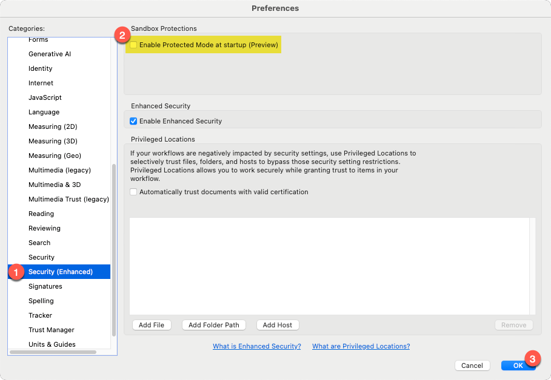
/// caption
<sup>Disable "Protected Mode" and restart Adobe Acrobat</sup>
///


#### Add a PKCS#11 Module

This step may or may not be required any longer. Truthfully, I don't know if this is unique to Apple Silicon or macOS in general, so test this for yourself to confirm whether or not it's even needed. 

On my system, macOS appears to automatically read from my Yubikey's PIV application and pull my Slot 9A and 9C certificates into KeyChain automatically. I say "*appears*" because while Adobe recognizes the keys and they appear under "Keychain Digital IDs" only when my Yubikey is connected, I cannot locate the keys in KeyChain Access. 

If your system does not automatically detect the certificates on your Yubikey, return to Adobe Preferences > Signatures, and click the "More" button under "Identities & Trusted Certificates."  

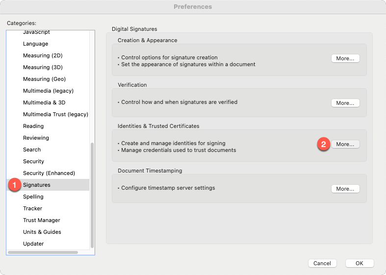
/// caption
<sup></sup>
///

Within the "Digital ID and Trusted Certificate Settings" window, expand "Digital IDs" from he left navigation menu if not already expanded, then click "PKCS#11 Modules and Tokans."  Select "Attach Module" from the top of the window, and enter the path to your Yubikey PKCS#11 module.<br />*(You must have Yubikey Manager / `ykman` installed in order for the module to exist at the locations specified.)*

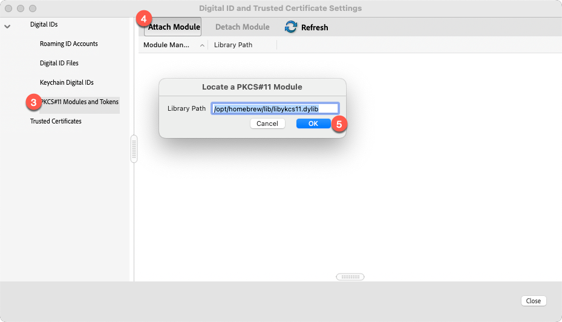
/// caption
<sup></sup>
///

Possible paths for the Yubikey PKCS#11 library:

* Apple Silicon:  `/opt/homebrew/lib/libykcs11.dylib`
* Intel Apple: `/usr/local/lib/libykcs11.dylib`
* Windows: `C:\Program Files (x86)\Yubico\Yubico PIV Tool\bin\libykcs11.dll` or `C:\Program Files\Yubico\Yubico PIV Tool\bin\libykcs11.dll`

After the module is added, click the "Login" button at the top of the window. You will be prompted to enter your Yubikey PIV PIN. If provided successfully, a list of certificates loaded to your Yubikey will appear on-screen. 


#### Certificate Settings

If you used the same Key Usage and Extended Key Usage values that I used, and loaded both keys to your Yubikey, you'll see both keys in the list. They may also both appear the same -- same name, same issuer, etc. 

Select one of the keys and click the "Certificate Details" button at the top of the window. The "Certificate Viewer" window will appear, and should be defaulted to the "Summary" tab. Look under "Intended Usage" near the center of this window -- if you see "Code Signing" and "Acrobat Authentic Documents," you've selected the correct key. 

Swith to the "Details" tab and scroll through the list of certificate data until you see "Serial number." Take note of this value, because this is how you can easily identify and differentiate your signing key from your authentication key. 

Click "OK" to close the Certificate Viewer and make sure you've still got the correct certificate selected. Click the "Usage Options" button at the top of the window, and select "Use for Signing," and again for "Use for Certifying."  A blue ribbon icon will appear to the left of the certificate name. 

By doing this, when you select the options to either sign or certify documents in the future, Adobe will prompt you to choose between the two certificates saved to your Yubikey. Setting the "use for" options will cause Adobe to default to correct certificate automatically. You can always verify and confirm this by clicking the "View Details" button beside the certificate and checking the "intended usage" values for "Code Signing" and "Acrobat Authentic Documents."

SSL.com Documentation [Configuring Your Business Identity Document SIgning Certificates and Yubikey with Adobe Acrobat on macOS](https://www.ssl.com/how-to/yubikey-document-signing-certificate-with-adobe-acrobat-macos/)


#### Add A Signature Image

To customize the appearance of your signatures and certifications, head back to Adobe Preferences > Signatures, but this time hit the button under "Creation & Appearance."

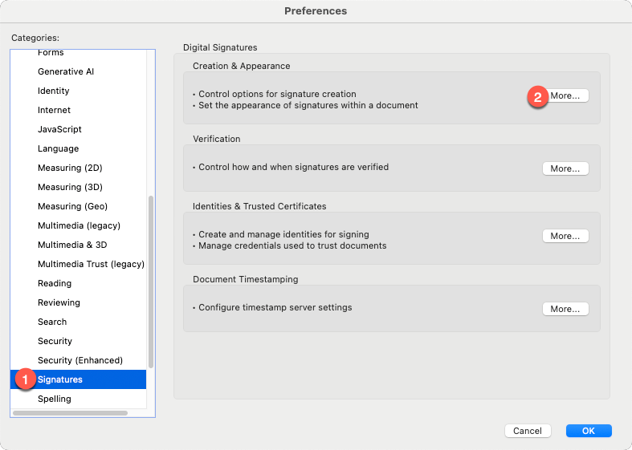
/// caption
<sup></sup>
///

In the "Creation and Appearance Preferences" window, leave everything as it is and click the "New" button under the "Appearances" section near the bottom. Give your signature a friendly title, set the "Configure Text" options according to your preferences, and in the "Configure Graphic" section, select "imported graphic" and click the "file" button. 

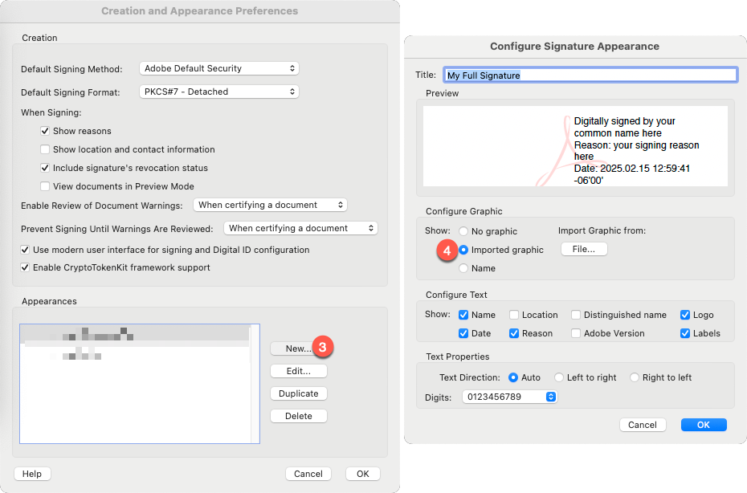
/// caption
<sup></sup>
///

You can create mulitiple appearances to fit your needs -- for example, you could have one version that was your full signature, and another variant that included your initials only. 


#### Sign or Certify

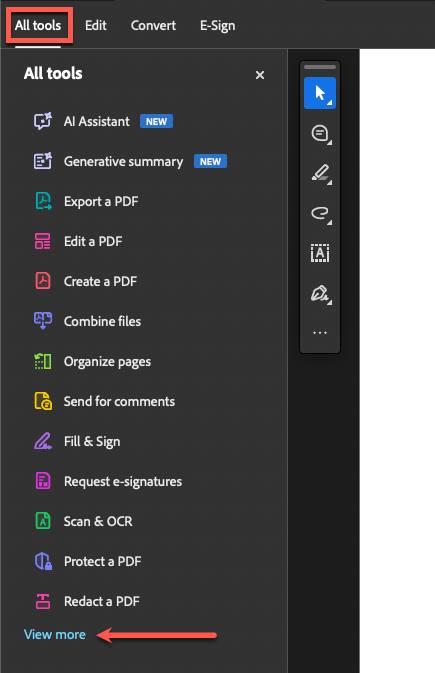{ align=left }

To begin the process of signing or certifying a document, start with the document open in Adobe Acrobat, select "All Tools" from the top left corner of the screen, then look for the "View More" button near the bottom of the list on the left side of the screen.

In the expanded list, you're looking for the option that says "Use a certificate."  It will be an aqua-colored icon of an ink pen nib. 

You'll be presented with five options -- four of which will be available if the document you're looking at has not been signed previously:

* Digitally sign
* Timestamp
* Certify (visible signature)
* Certify (invisible signature)

The options are as they sound -- digitally signing is only providing an authenticated signature. The idea is that this signature proves that you were the one who did it.  Certify has the effect of "hashing" the document so that your recipient can compute the hash themselves to check and confirm that the document hasn't been tampered with.  In fact, this is what the grayed-out option on your screen is -- "Validate all signatures." 

With Certify, you have two optionis -- to include a visible signature, or not.  Most often, you're going to be using either the Digitally Sign or Certify with Visible Signature options. 

Select the option to "Digitally sign" the document. Adobe will throw a pop-up notification instructing you to *"click and drag to draw the area where you would like the signature to appear."*  This behavior is the same for both Digitally Sign and Certify with Visibile Signature.  Click "OK" and find an open area of the screen to click-and-drag a moderately large horizontal rectangle. 

As soon as you release the mouse, Adobe will display the "Sign with a Digital ID" window. If you specified which certificate should be used for Signing and Certifying, the default selection *should* be your Slot 9c certificate. Double-check this by selecting the "View Details" button beside the certificate name. 

Select the "Continue" button to move onto the appearance settings for your signature. By default, Adobe will pre-select "Standard Text." If you uploaded a signature image earlier, you can select the dropdown box at the top of this window to select your full signature or initial-only variants. 

***If you chose "Digitally sign":***

* You will have the additional option of "Locking" the document after signing, plus any other optional settings you might have enabled within the appearance settings, such as adding a signature reason or location. 

***If you chose "Certify with Visible Signature":***

* In addition to any optionsl settings you enabled, you'll also see options for "Permitted Actions After Certifying" and "Review document content that may affect signing." 
     * Permitted Actions allow you to determine whether anyone is allowed to make any kind of changes after you've certified the document. You can optionally allow other people to fill out any forms in the document and provide their own signatures, or also allow them to make annotations on the document. 
     * The "Review" button will show you a list of all of the properties of the PDF document that could create problems for certifying the document. These are items that *could* cause a document to be rendered "invalid" due to having changed AFTER you certified it. Review these carefully before taking action from the prompts on-screen. 

Finally, when you click "OK" to create your signature, Adobe will prompt you to select where you want to save the signed version of your document. This is to allow you you to save your signed document as a new file without overwriting the original document you were working from. 

The final prompt may be a PIN request popup from Adobe looking for you to enter your Yubikey PIV PIN in order to complete the signature. 

SSL.com Documentation: [Digitally Sign a PDF in Adobe Acrobat Reader using a Yubikey](https://www.ssl.com/how-to/sign-a-pdf-in-adobe-acrobat-reader/)


---


## At least one signature has problems

If you went the route of using your own custom PKI instead of paying for an Adobe ATL certificate, Adobe will display a caution / warning prompt at the top of your signed document. The reason for this is because Adobe doesn't trust your custom Root CA / Intermediate CA. 

Select the "Signature Panel" button to open the details dialog for the signature warning from Adobe. Adobe will provide a breakdown of what it sees as potentially problematic about the signature and will include a button to view the certificate details. 

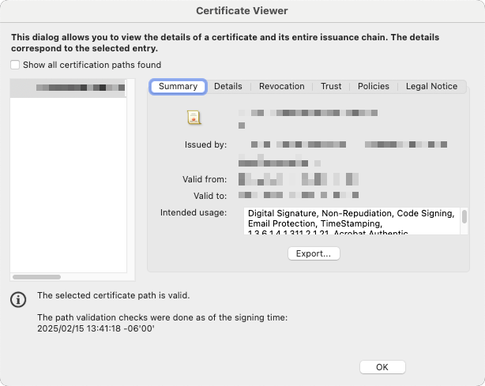
/// caption
<sup></sup>
///

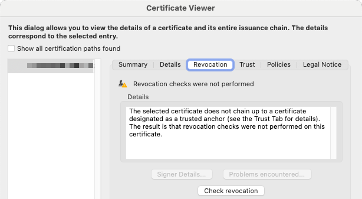
/// caption
<sup></sup>
///

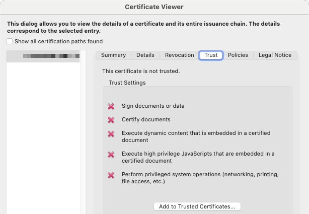
/// caption
<sup></sup>
///

## Add Trusted Certificates


There are two routes you can take to resolve this. 

* Option 1: Select "Add to Trusted Certificates" from the "Trust" tab. 
* Option 2: Add the Root CA / Intermediate CA to the Trusted Certificates list.

Option 2 is the better approach, assuming your recipient indeed trusts the certificates you or your company are issuing. If you try to use the "Add to Trusted Certificates" button on the Trust tab, Adobe will display a warning that adding certificates directly from a document is unsafe. 

This is where its helpful to have the Root CA and Intermediate CA available directly from your Yubikey. 

``` bash
# Export a copy of the Root CA
ykman piv certificates export 82 my-root-ca.crt

# Export a copy of the Intermediate CA
ykman piv certificates export 83 my-intermediate-ca.crt
```

With the two `.crt` files saved, navigate back to Adobe Preferences > Signatures > Identities & Trusted Certificates. Select "Trusted Certificates" from the left navigation menu, then seelct "Import." 

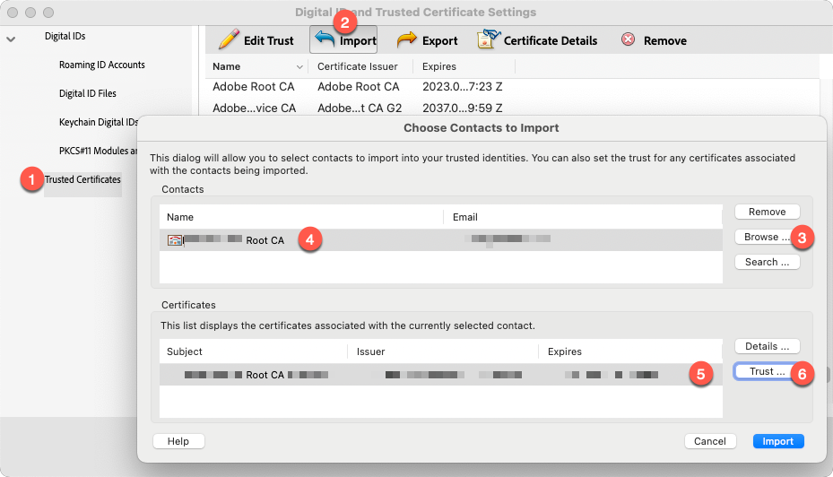
/// caption
<sup></sup>
///

In the dialog window that appears, select "Browse," then navigate to the `.crt` file you just exported from your Yubikey for the Root CA Certificate. When selected, click the name of the certificate in the top box on this window to populate the "Certificates" list in the lower half. 

Select the certificate itself in the lower box, then click the "Trust" button directly to the right.

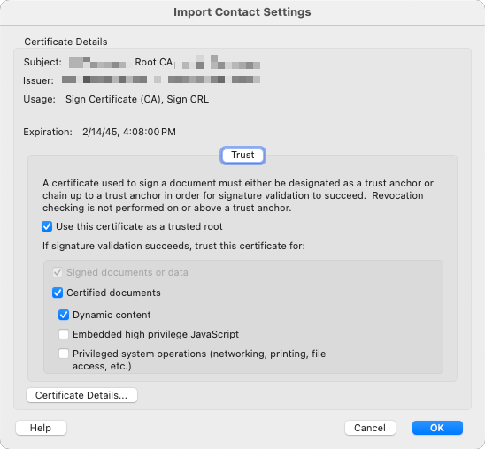
/// caption
<sup></sup>
///

From the "Import Contact Settings" box, select the checkboxes that represent the level of trust you have for the certificate. To mark the certificate as trusted, at a minimum it requries the *"Use this certificate as a trusted root"* selection. But in addition, there are other options you can enable / toggle depending on the level of trust you have. When you've finished making your selections, click "OK" in the bottom right corner, then click "Import" on the previous dialog box. 

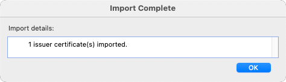
/// caption
<sup></sup>
///

If successful, you should see a "Import Complete" popup box with an "OK" button. Click to dismiss. Repeat the import process to import the Intermediate CA certificate as well.

Finally, re-open the document you signed previously. A notification bar across the top of the document should now reflect *"Signed and all signatures are valid."* Click into the "Signature Panel" for details.

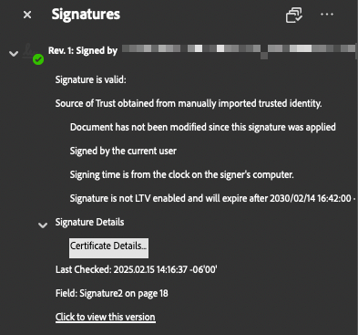
/// caption
<sup></sup>
///

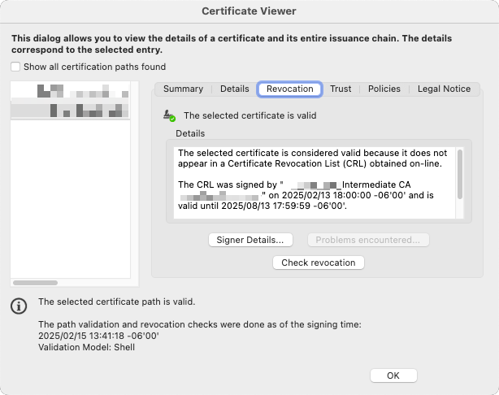
/// caption
<sup></sup>
///
